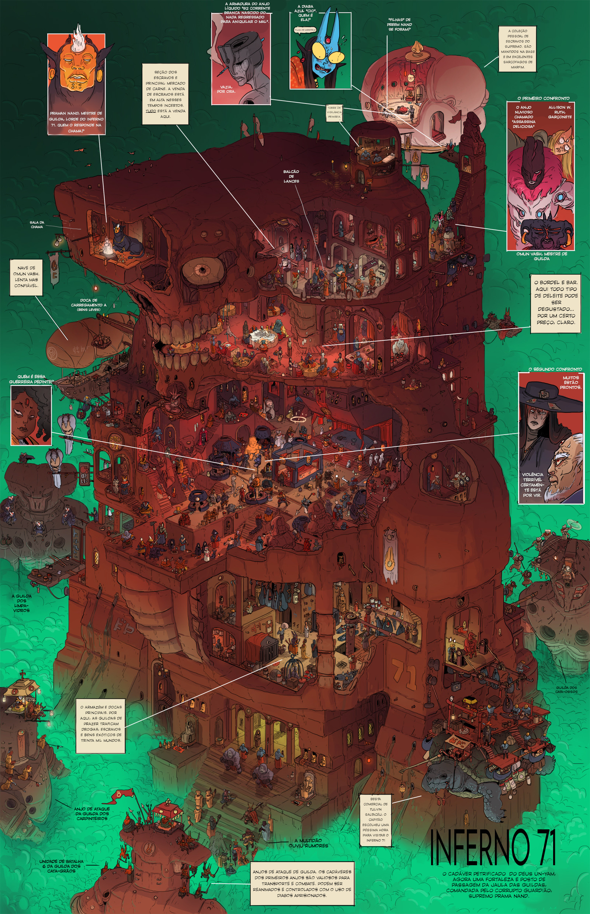

+++
title = 'Test M6bd Page'
date = 2024-04-13T08:22:16-03:00
draft = false
+++

## MSBD 4-55 to 4-56 (CAPÍTULO 4)

“O! Deuses-defuntos da sorte!

Prendam vossos ganchos em nossas carnes que suplicam!

Levem-nos dos odiosos cardumes da margem até às encostas abençoadas do santo Lucro,

e que nossos caixas sejam oceano!"

-Reza da guilda
